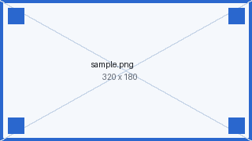
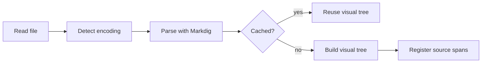
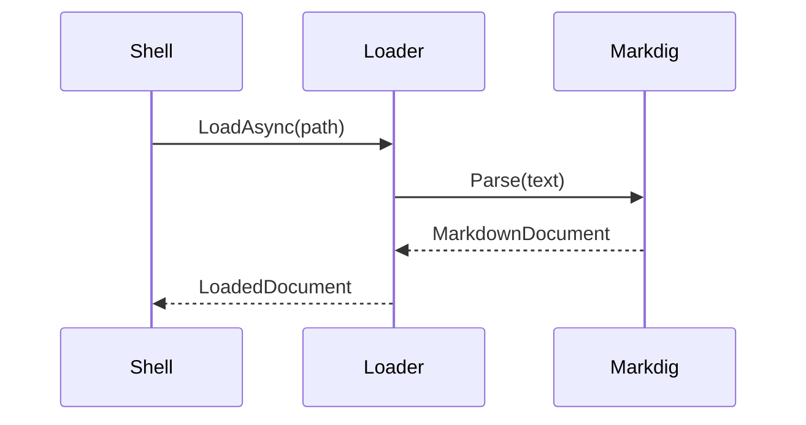

# Rendering Test Document

This document exercises every Markdown construct KT MD Viewer is expected to
handle, plus a collection of edge cases that break naive renderers. It is meant
to be read side by side with `docs/SPECIFICATION.md` §5.1, which defines the
dialect.

**How to use it:** open it in Preview, scroll through, then press `Ctrl+E` and
compare against the raw source. Anything that looks wrong in Preview but right
in Raw is a renderer bug. Anything that looks wrong in both is probably this
document being deliberately awkward — those places say so.

Sections marked **NOT ENABLED** describe syntax the pipeline deliberately does
not turn on. Those must render as literal text, not silently disappear.

---

## 1. Headings

# Heading level 1

## Heading level 2

### Heading level 3

#### Heading level 4

##### Heading level 5

###### Heading level 6

####### Seven hashes is not a heading

Setext heading level 1
======================

Setext heading level 2
----------------------

### Heading with `code`, **bold**, *italic* and a [link](https://example.com)

### Heading with trailing hashes

### Heading with leading whitespace after the hashes

#Not a heading — no space after the hash

### Heading with an emoji 🚀 and a trailing space

---

## 2. Paragraphs and line breaks

A plain paragraph. It has enough text in it to wrap on a normal window, which is
the point: the reader should be able to judge line length, leading, and where the
measured column ends.

This paragraph is separated from the one above by a blank line.

This line ends with two spaces,  
so this should be a **hard break** inside the same paragraph.

This line ends with a backslash,\
so this should also be a hard break.

This line
is separated by a single newline, which is a **soft** break and should render as
a single space.

Three or more blank lines follow this one.

The paragraph after the blank lines.

    This line starts with a tab, which makes it an indented code block, not a paragraph.

---

## 3. Inline formatting

### 3.1 Standard emphasis

*Italic with asterisks* and _italic with underscores_.

**Bold with asterisks** and __bold with underscores__.

***Bold italic*** and ___bold italic with underscores___.

**Bold containing *italic* inside** and *italic containing **bold** inside*.

Intra*word*emphasis with asterisks works; intra_word_emphasis with underscores
should **not** be emphasised.

A lone * asterisk and a lone _ underscore in running text.

Unclosed **emphasis at the end of a paragraph

### 3.2 Emphasis extras

~~Strikethrough~~ text.

H~2~O uses subscript. E = mc^2^ uses superscript.

++Inserted text++ and ==marked text==.

~~**Bold inside strikethrough**~~ and **~~strikethrough inside bold~~**.

### 3.3 Inline code

Simple `inline code`.

Code containing a backtick: `` ` ``

Code containing double backticks: ``` `` ```

Code with markup that must not be interpreted: `**not bold**`, `<div>`, `[link](x)`.

Code with a very long unbroken token that has to wrap or scroll:
`abcdefghijklmnopqrstuvwxyz0123456789abcdefghijklmnopqrstuvwxyz0123456789abcdefghijklmnopqrstuvwxyz`

Empty code span: `` and code with leading/trailing spaces: ` padded `.

---

## 4. Links

### 4.1 Forms

An [inline link](https://example.com).

An [inline link with a title](https://example.com "The title attribute").

A [reference link][ref-one].

A [collapsed reference link][].

A [shortcut reference link].

An autolink in angle brackets: <https://example.com/path?query=1&other=2>

A bare autolink: https://example.com/bare

An email autolink: <someone@example.com>

A mailto link: [write to someone](mailto:someone@example.com).

### 4.2 Targets

A [relative link to the README](../README.md) — should open in a new tab.

A [relative link with an anchor](../README.md#try-this).

A [link to a heading in this document](#4-links).

A [link to a heading that does not exist](#no-such-heading) — should report, not crash.

A [link to a file that does not exist](./nope/missing.md) — should show as broken.

A [link to a non-Markdown file](../MdViewer.slnx) — should require confirmation.

A [link with an unusual scheme](ftp://example.com/file) — should be refused.

### 4.3 Awkward link text

A [link with **bold** and `code` inside](https://example.com).

A [link with [brackets] in the text](https://example.com).

A [link with an extremely long label that will certainly need to wrap across more than one line in any reasonable window width](https://example.com).

A link with a very long URL:
[short label](https://example.com/a/very/long/path/that/keeps/going/and/going/and/going/until/it/is/certainly/longer/than/the/content/column?with=query&parameters=too)

An empty link: [](https://example.com)

A [link][undefined-reference] whose reference is never defined.

[ref-one]: https://example.com/reference-one "Reference one"
[collapsed reference link]: https://example.com/collapsed
[shortcut reference link]: https://example.com/shortcut
[unused-reference]: https://example.com/never-used

---

## 5. Images

### 5.1 Local

A local image, inline: 

The same image as a block:


An image that does not exist: 

An image with no alt text: 

### 5.2 Remote

A remote image, which must **not** be fetched without consent:


### 5.3 Combinations

An [image inside a link](https://example.com) — 

A reference image: ![Reference image][img-ref]

[img-ref]: assets/sample.png "Referenced"

Text with an image  in the middle of a sentence, to
see how the baseline behaves.

---

## 6. Lists

### 6.1 Bullet lists

- Item with a hyphen

- Another item

- A third item
* Item with an asterisk

* Another item
+ Item with a plus

+ Another item

### 6.2 Ordered lists

1. First

2. Second

3. Third

4. All ones

5. All ones

6. All ones

7. Starting at five

8. Six

9. Seven
1) Using a parenthesis

2) Second

### 6.3 Tight and loose

A tight list:

- One
- Two
- Three

A loose list:

- One

- Two

- Three

### 6.4 Wrapping and alignment

- A list item long enough to wrap onto a second line, which is the case that
  matters: the continuation must align under the first line of the item and not
  slide back under the marker.
- Short item.
- Another item that wraps, again with enough words in it to be sure the wrap
  actually happens at ordinary window widths.

### 6.5 Nesting

- Level one
  
  - Level two
    - Level three
      - Level four
        - Level five
          - Level six

- Back to level one
1. Ordered level one
   
   1. Ordered level two
      1. Ordered level three
   2. Back to level two

2. Back to level one
- Mixed: bullet
  1. then ordered
     - then bullet again

### 6.6 Items containing other blocks

- An item with two paragraphs.
  
  This is the second paragraph of the same item. The marker appears only on the
  first paragraph.

- An item containing a fenced code block:
  
  ```csharp
  var renderer = new MarkdownRenderer();
  ```

- An item containing a block quote:
  
  > Quoted inside a list item.

- An item containing a table:
  
  | A   | B   |
  | --- | --- |
  | 1   | 2   |

- An item containing a nested list and then more text:
  
  - Nested
  - Nested
  
  Trailing paragraph after the nested list.

### 6.7 Task lists

- [x] Completed task

- [ ] Incomplete task

- [x] Completed with a capital X

- [ ] Task with **bold** and `code` and a [link](https://example.com)

- [ ] Parent task
  
  - [x] Nested completed
  - [ ] Nested incomplete

- Ordinary item in the same list as tasks

### 6.8 Awkward lists

- 

- Empty item above this one

- Item with trailing spaces   
1. An ordered list starting at a large number

2. Ninety-nine-nine

3. One thousand
- Item
  Lazy continuation line that belongs to the item above.

---

## 7. Block quotes and callouts

### 7.1 Block quotes

> A simple block quote.

> A block quote spanning
> two source lines.

> A block quote with a
> lazy continuation line.

> First paragraph of a quote.
> 
> Second paragraph of the same quote.

> ### A heading inside a quote
> 
> - A list inside a quote
> - Second item
> 
> ```text
> A code block inside a quote
> ```
> 
> | A   | B   |
> | --- | --- |
> | 1   | 2   |

> Level one
> 
> > Level two
> > 
> > > Level three
> > > 
> > > > Level four

### 7.2 GitHub alerts

> [!NOTE]
> Useful information the user should know.

> [!TIP]
> Helpful advice.

> [!IMPORTANT]
> Key information.

> [!WARNING]
> Urgent info needing attention.

> [!CAUTION]
> Advises about risks.

### 7.3 Custom containers

::: note
A custom container of kind `note`.
:::

::: warning
A custom container of kind `warning`, containing **formatting** and a list:

- One
- Two
  :::

::: unknown-kind
A container with a kind the renderer does not recognise.
:::

---

## 8. Code

### 8.1 Fenced, with a language

```csharp
public sealed class HeadingBlockRenderer : IBlockRenderer
{
    public bool CanRender(Block block) => block is HeadingBlock;

    public Control Render(Block block, RenderContext context)
    {
        var heading = (HeadingBlock)block;
        var level = Math.Clamp(heading.Level, 1, 6);
        return context.Renderer.CreateTextBlock(heading, $"md-h{level}", context);
    }
}
```

```python
def fibonacci(n: int) -> int:
    """Docstring with 'quotes' and "double quotes"."""
    a, b = 0, 1
    for _ in range(n):
        a, b = b, a + b
    return a
```

```json
{
  "name": "MdViewer",
  "nested": { "array": [1, 2, 3], "null": null, "bool": true },
  "escaped": "a \"quoted\" string with a \\ backslash"
}
```

```bash
#!/usr/bin/env bash
set -euo pipefail
for f in "$here"/hicolor/*/apps; do
    cp "$f"/* "$target/" || echo "skipped $f" >&2
done
```

```xml
<Style Selector=":is(TextBlock).md-body">
  <Setter Property="TextWrapping" Value="Wrap" />
</Style>
```

```sql
SELECT d.title, COUNT(*) AS hits
FROM documents d JOIN views v ON v.doc_id = d.id
WHERE v.opened_at >= NOW() - INTERVAL '7 days'
GROUP BY d.title ORDER BY hits DESC LIMIT 10;
```

### 8.2 Fenced, other forms

Without a language:

```
Plain fenced block.
No language, no highlighting.
```

With tildes:

```
A fence made of tildes, containing ``` backticks ``` that are not a fence.
```

Four backticks containing a three-backtick fence:

```markdown
```csharp
var nested = true;
```

```
With an unknown language:

```not-a-real-language
This should render unhighlighted, not as an error.
```

With extra info-string words:

```csharp
Console.WriteLine("The info string has more than a language in it.");
```

An empty fenced block:

```

```

### 8.3 Indented code

    An indented code block.
    Four spaces of indentation.
        Deeper indentation is preserved.

### 8.4 Awkward code

A block with very long lines that must scroll horizontally rather than widen the page:

```text
This single line is deliberately far longer than the content column so that the horizontal scrolling behaviour of the code block can be verified without ambiguity, and it keeps going well past any reasonable window width.
    Tab-indented line.
Trailing whitespace on this line:   
```

A block containing characters that look like markup:

```text
# Not a heading
- Not a list
> Not a quote
| Not | a table |
**not bold**  <div>not html</div>
```

A block with Unicode and box drawing:

```text
┌─────────────┬─────────────┐
│ Kolonne     │ Verdi       │
├─────────────┼─────────────┤
│ Æ Ø Å       │ æ ø å       │
│ 日本語      │ テスト       │
└─────────────┴─────────────┘
```

### 8.5 Mermaid





---

## 9. Tables

### 9.1 Basic

| Column A | Column B | Column C |
| -------- | -------- | -------- |
| A1       | B1       | C1       |
| A2       | B2       | C2       |

### 9.2 Alignment

| Left        | Centre      | Right       |
|:----------- |:-----------:| -----------:|
| a           | b           | c           |
| longer cell | longer cell | longer cell |
| 1           | 22          | 333         |

### 9.3 Content in cells

| Element      | Example                                                                                                                                    | Notes                         |
| ------------ | ------------------------------------------------------------------------------------------------------------------------------------------ | ----------------------------- |
| Bold         | **bold**                                                                                                                                   | Inline formatting must render |
| Code         | `code`                                                                                                                                     | Including `                   |
| Link         | [example](https://example.com)                                                                                                             | Clickable inside the cell     |
| Image        |                                                                                                                  | Sizing inside a cell          |
| Escaped pipe | a \| b                                                                                                                                     | The pipe is literal           |
| Empty        |                                                                                                                                            | The cell above is empty       |
| Long         | This cell contains a good deal of text, enough that it has to wrap inside the cell rather than widening the whole table beyond the window. | Wrapping                      |

### 9.4 Ragged and degenerate

Fewer cells in a row than in the header:

| A   | B   | C   |
| --- | --- | --- |
| 1   | 2   |     |
| 1   | 2   | 3   |

A table with no body rows:

| Header only |
| ----------- |

A single-column table:

| One |
| --- |
| a   |
| b   |

### 9.5 Wide

| #   | Name           | Type   | Default | Required | Since | Deprecated | Description                             | See also |
| --- | -------------- | ------ | ------- | -------- | ----- | ---------- | --------------------------------------- | -------- |
| 1   | `zoom`         | double | 1.0     | no       | M1    | no         | Per-tab zoom factor between 0.5 and 3.0 | §5.11    |
| 2   | `viewMode`     | enum   | Preview | no       | M2    | no         | Preview or Source                       | §5.15    |
| 3   | `scrollOffset` | int    | 0       | no       | M2    | no         | Reading position as a source offset     | §5.10    |
| 4   | `encoding`     | enum   | Utf8    | no       | M2    | no         | Detected document encoding              | §5.10    |
| 5   | `lineEndings`  | enum   | Lf      | no       | M2    | no         | Detected line ending style              | §5.10    |

### 9.6 Grid table

+---------------+---------------+--------------------+
| Fruit         | Price         | Advantages         |
+===============+===============+====================+
| Bananas       | $1.34         | - built-in wrapper |
|               |               | - bright colour    |
+---------------+---------------+--------------------+
| Oranges       | $2.10         | - cures scurvy     |
|               |               | - tasty            |
+---------------+---------------+--------------------+

---

## 10. Footnotes, definitions, abbreviations

### 10.1 Footnotes

A sentence with a footnote reference.[^1]

A second reference.[^named]

A reference used twice.[^1]

[^1]: The first footnote. It should render at the end of the document with a
    back-link to its reference.

[^named]: A footnote with a name rather than a number, containing **formatting**,
    `code`, and a [link](https://example.com).

    A second paragraph inside the same footnote.

### 10.2 Definition lists

Term
:   The definition of the term.

Another term
:   First definition.
:   Second definition of the same term.

Term with a complex definition
:   A definition containing **formatting** and a list:

    - One
    - Two

### 10.3 Abbreviations

The HTML specification is maintained by the W3C. MVVM is the pattern used here.

*[HTML]: HyperText Markup Language
*[W3C]: World Wide Web Consortium
*[MVVM]: Model-View-ViewModel

---

## 11. Raw HTML and entities

### 11.1 Inline HTML

Raw HTML is escaped rather than rendered (§5.6). These must appear as visible
literal text:

A <b>bold</b> tag, an <i>italic</i> tag, a <kbd>Ctrl</kbd>+<kbd>E</kbd> pair,
a <br> break, a <mark>mark</mark>, <sub>sub</sub> and <sup>sup</sup>.

A <span style="color: red">styled span</span>.

An <a href="https://example.com">anchor tag</a>.

An  tag.

### 11.2 Block HTML

<div class="container">
  <p>A block of raw HTML.</p>
  <ul><li>With a list</li></ul>
</div>

<table>
  <tr><th>HTML table</th></tr>
  <tr><td>Not a Markdown table</td></tr>
</table>

<details>
<summary>A details element</summary>

Content inside the details block.

</details>

### 11.3 HTML that must never execute

<script>alert('this must never run');</script>

<iframe src="https://example.com"></iframe>


### 11.4 Comments

<!-- An HTML comment. Hidden by default; there is a setting to show them. -->

Text after the comment.

### 11.5 Entities

Named: &amp; &lt; &gt; &quot; &copy; &reg; &trade; &hellip; &mdash; &nbsp;

Numeric: &#65; &#x42; &#8212; &#128512;

Not an entity: &notreal; &#; &amp

---

## 12. Escapes and near-misses

Backslash escapes: \* \_ \# \[ \] \( \) \` \\ \| \{ \} \! \+ \- \. \<

\*This should not be italic\*

\# This should not be a heading

\- This should not be a list item

\> This should not be a quote

Text that looks like markup but is not:

- A snowman :snowman: — emoji shortcodes are not enabled
- An asterisk in maths: 3 * 4 * 5 = 60
- An underscore in an identifier: some_variable_name
- A hash in a colour: #FF8800
- A pipe outside a table: a | b | c
- Angle brackets: 5 < 10 > 3
- A URL-looking string that is not a link: not.a.real.tld/path

---

## 13. Unicode and text shaping

### 13.1 Scripts

Norwegian: Æ Ø Å æ ø å — «norske anførselstegn» og en tankestrek –

German: Größenwahn, Straße, Müller

Greek: Ελληνικά αλφάβητο

Cyrillic: Кириллица тест

CJK: 日本語のテキスト、中文文本，한국어 텍스트

Right-to-left Arabic: هذا نص عربي للاختبار

Right-to-left Hebrew: זהו טקסט עברי לבדיקה

Mixed direction: The Arabic word سلام means peace, then back to English.

### 13.2 Emoji

Simple: 😀 🎉 ✅ ⚠️ 📄

Skin tone: 👋🏻 👋🏽 👋🏿

ZWJ sequences: 👨‍👩‍👧‍👦 👩‍💻 🏳️‍🌈

Emoji in **bold** and in `code`: 🚀 and `🚀`

### 13.3 Combining and invisible characters

Combining diacritics: e + ́ = é (composed: é)

Zero-width space between these two words: a​b

Non-breaking space between these: a b

Soft hyphen inside a long word: super­cali­fragilistic­expiali­docious

### 13.4 Long unbroken strings

A very long word that cannot be broken at a space:

Pneumonoultramicroscopicsilicovolcanoconiosisandthensomemorecharactersappendedtomakeitlongerstill

A long path:

`C:\Source2\MdViewer\src\MdViewer.Rendering\Blocks\TableBlockRenderer.cs`

---

## 14. Extensions not enabled

Everything in this section must render as literal text.

### 14.1 Mathematics — NOT ENABLED

Inline: $E = mc^2$ and $\frac{a}{b}$

Block:

$$
\int_{0}^{\infty} e^{-x^2}\,dx = \frac{\sqrt{\pi}}{2}
$$

### 14.2 Smart punctuation — NOT ENABLED by default

Three dots... two hyphens -- three hyphens --- "straight quotes" 'single quotes'

### 14.3 Generic attributes — NOT ENABLED

A paragraph with an attribute block.
{: .some-class #some-id }

### 14.4 Emoji shortcodes — NOT ENABLED

:smile: :rocket: :+1:

### 14.5 Figures

^^^

^^^ A figure caption

---

## 15. Pathological cases

### 15.1 Deeply nested mixture

> - A list inside a quote
>   
>   > - A quote inside a list inside a quote
>   >   
>   >   - A list inside that
>   >     
>   >     ```text
>   >     A code block at the bottom of it all
>   >     ```

### 15.2 Adjacent blocks with no blank line

# Heading immediately followed by a paragraph

Paragraph text with no blank line above it.

- List item with no blank line above it

> Quote with no blank line above it

### 15.3 Thematic breaks

---

***

___

- - -

* * *

A thematic break made of underscores immediately after a paragraph:

___

### 15.4 Whitespace

A line with only spaces follows this one.

A line with only a tab follows this one.

Both should be treated as blank.

### 15.5 Long document behaviour

This section exists to give the document enough length to be worth scrolling.
Everything below is filler with a predictable shape, so a scroll-position bug is
easy to spot: each paragraph is numbered.

Filler paragraph 01 — the quick brown fox jumps over the lazy dog, and then does
so again at a slightly different width so the line breaks land differently.

Filler paragraph 02 — the quick brown fox jumps over the lazy dog, and then does
so again at a slightly different width so the line breaks land differently.

Filler paragraph 03 — the quick brown fox jumps over the lazy dog, and then does
so again at a slightly different width so the line breaks land differently.

Filler paragraph 04 — the quick brown fox jumps over the lazy dog, and then does
so again at a slightly different width so the line breaks land differently.

Filler paragraph 05 — the quick brown fox jumps over the lazy dog, and then does
so again at a slightly different width so the line breaks land differently.

Filler paragraph 06 — the quick brown fox jumps over the lazy dog, and then does
so again at a slightly different width so the line breaks land differently.

Filler paragraph 07 — the quick brown fox jumps over the lazy dog, and then does
so again at a slightly different width so the line breaks land differently.

Filler paragraph 08 — the quick brown fox jumps over the lazy dog, and then does
so again at a slightly different width so the line breaks land differently.

---

## 16. Outline and anchors

The headings below are duplicates on purpose. Auto-identifiers must make each
slug unique — `#overview`, `#overview-1`, `#overview-2` — so that anchor links
resolve to the right one.

### Overview

First Overview.

### Overview

Second Overview. [Link to the first](#overview), [link to this one](#overview-1).

### Overview

Third Overview. [Link to this one](#overview-2).

### Heading with punctuation: colons, commas & ampersands!

Slug generation has to strip punctuation. [Link to it](#heading-with-punctuation-colons-commas--ampersands).

### 日本語の見出し

A heading in a non-Latin script.

### A heading that skips a level

##### Straight from level 3 to level 5

The outline must nest this under the level 3 above rather than dropping it or
promoting it.

---

## 17. End matter

If you have reached this line in Preview and the document above rendered without
an error card, the block renderers survived the full corpus.

Footnote definitions render below this point.
